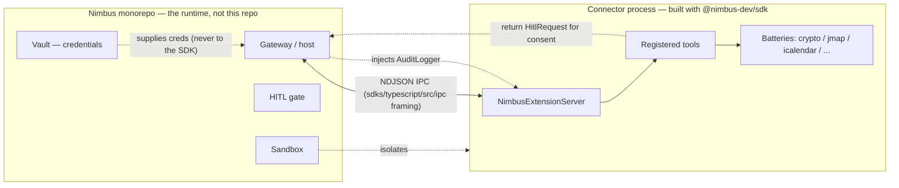
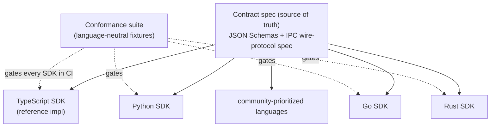

# nimbus-sdk — Architecture

How `@nimbus-dev/sdk` is put together today, and the structural direction the
[roadmap](./ROADMAP.md) is taking it. For the trust / supply-chain model see
[SECURITY.md](./SECURITY.md).

## What this package is

`@nimbus-dev/sdk` is the **authoring contract** for Nimbus MCP connectors and
extensions — the stable, MIT-licensed, **dependency-free** surface that connector
code compiles against. It is types, small pure helpers, and test utilities. It is
**not** the runtime: the gateway, Vault (credentials), HITL (human-in-the-loop)
gate, and the connector sandbox all live in the
[Nimbus](https://github.com/nimbus-agent/Nimbus) monorepo.

Three hard constraints shape every decision here:

- **Dependency-free at runtime.** The published package declares no
  `dependencies`. If a helper is needed, it is inlined. This keeps the
  supply-chain surface equal to this repo's own source.
- **No I/O, no credentials.** The SDK never touches the filesystem, network, or
  environment. Anything that does belongs in the gateway.
- **TypeScript strict, no `any`.** External / cross-boundary data enters as
  `unknown` and is narrowed with a type guard. Biome enforces `noExplicitAny` and
  `noConsole` in `sdks/typescript/src/`.

## The public surface (the `exports` map)

The package exposes exactly five entry points. Everything else is internal.

| Entry point | Source | Purpose |
|---|---|---|
| `@nimbus-dev/sdk` | `sdks/typescript/src/index.ts` | The main contract: connector/extension types, the Plugin API v1 surface, `NimbusExtensionServer`, and the battery modules. |
| `@nimbus-dev/sdk/testing` | `sdks/typescript/src/testing/index.ts` | `MockGateway` + contract-test / sandbox-probe utilities for connector test suites. |
| `@nimbus-dev/sdk/ipc` | `sdks/typescript/src/ipc/index.ts` | The NDJSON line-reader + IPC framing helpers. |
| `@nimbus-dev/sdk/connector-kit` | `sdks/typescript/src/connector-kit/index.ts` | Dependency-free helpers for hand-rolled MCP connectors: Zod tool registration (`ZodObjectSchema` is a structural type, not a `zod` import), MCP result wrapping, and the Bearer-auth REST fetcher. The generated TypeScript connector template imports from here. |
| `@nimbus-dev/sdk/diagnostics` | `sdks/typescript/src/diagnostics/index.ts` | The diagnostics / telemetry contract v0: `encodeDiagnostic` / `parseDiagnostic` / `isDiagnosticEvent` / `meetsLevel`, the closed `DiagnosticEvent` envelope, and `createEmitter` for a sink-backed `DiagnosticEmitter`. The redaction-safe replacement for the scoped audit logger's free-form payload. |

Changing an exported type is a semver-relevant change — Conventional Commits drive
the release-please bump. The `exports` map, not the file tree, is the API.

## Internal layers

The source is organized into four layers, from most-stable to most-peripheral.

### 1. The contract (the narrow waist)

The shared shapes every author and every product agree on — the *narrow waist* the
whole ecosystem passes through.

- `sdks/typescript/src/types.ts` — `ExtensionManifest`, `NimbusItem`, `ItemType`.
- `sdks/typescript/src/item-types.ts` — the open `KnownItemType` vocabulary + `isKnownItemType`.
- `sdks/typescript/src/agents/` — the agent **briefs** (`brief-types.ts`, `brief-composites.ts`),
  their runtime **guards** (`brief-guards.ts`, `guard-factory.ts`), and the agent
  name registry (`agent-names.ts`).
- `sdks/typescript/src/hitl-request.ts` / `sdks/typescript/src/audit-logger.ts` — the HITL
  request shape and the scoped audit-logger interface the gateway injects.

This layer is frozen under semver (Plugin API v1 — see
[`../sdks/typescript/CHANGELOG.md`](../sdks/typescript/CHANGELOG.md)).

### 2. The server scaffolding

- `sdks/typescript/src/server.ts` — `NimbusExtensionServer`, the MCP server a connector
  instantiates to register tools and start serving. This is the primary thing a
  connector author touches.

### 3. The batteries (helper modules)

Pure, dep-free helpers connector authors reach for so common work isn't
reinvented. Each is self-contained and independently testable:

- `sdks/typescript/src/crypto/` — Ed25519 keygen + manifest signing/verification, JWT
  signing, Google service-account tokens, App Store Connect JWTs, canonical JSON.
- `sdks/typescript/src/jmap-fastmail/` — JMAP session parsing + email header/preview
  extraction (headers, attachment metadata, and a server-truncated body preview capped
  at 2 KB per email — a hard scope constraint keeps full bodies and attachment bytes out).
- `sdks/typescript/src/icalendar.ts` — iCalendar VEVENT parsing + building.
- `sdks/typescript/src/data-profile/` — column/shape profiling for CSV / JSON / JSONL /
  Parquet (metadata only — never cell values).
- `sdks/typescript/src/flux-cd/`, `sdks/typescript/src/storybook/` — small format helpers.
- `sdks/typescript/src/distribution-channel.ts` — release-channel resolution + upgrade
  hints.

Growth here is deliberately gated by the [inclusion policy](./INCLUSION-POLICY.md)
(dep-free, pure, genuinely reused, contract-shaped) — see also the
[roadmap](./ROADMAP.md#3-batteries-for-connectors--apps).

### 4. Test harness & IPC

- `sdks/typescript/src/contract-tests.ts` — `runContractTests`, which validates a
  connector against the v1 contract (e.g. `assertNoRowDataTools`).
- `sdks/typescript/src/testing/` — `MockGateway` (in-process gateway stub) and the
  sandbox contract / probe utilities.
- `sdks/typescript/src/ipc/` — the NDJSON line-reader that frames messages between a
  connector process and its host.

## Runtime model: how a connector talks to the gateway

A connector is a **separate process** the gateway spawns inside a sandbox. The two
communicate over a stdio stream using **NDJSON line framing** (one JSON value per
line — the `sdks/typescript/src/ipc/` helpers). The SDK builds the *connector* side of
this boundary; the gateway is the host.

Key properties this model gives us:

- **The SDK holds no secrets.** Credentials live in Vault; the gateway supplies
  what a tool needs. The SDK just defines the shapes.
- **Consent is a value, not a side effect.** A tool returns a `HitlRequest`; the
  gateway drives the actual human approval. `isHitlRequest` narrows it.
- **The boundary is a wire protocol.** Because connector ↔ gateway is NDJSON over
  stdio, the connector side is not intrinsically tied to TypeScript — which is the
  hinge the polyglot direction turns on.

## Target architecture: spec-first, one contract, many languages

Today the contract is still largely the TypeScript types, but the lift-out into a
**language-neutral spec** has started: the v1 JSON Schemas for `ExtensionManifest` /
`NimbusItem` are published and CI-pinned in [`spec/`](./spec/README.md); the written
IPC wire-protocol spec and contract-version negotiation are what remain. Together
they become the single source of truth. TypeScript becomes the *reference binding*,
not the definition, and every other official SDK is another binding validated
against **one shared conformance suite**.

"It compiles" then means "it speaks the real contract," because a binding only
ships once it passes the same suite the reference implementation does. The
conformance suite is seeded from today's `runContractTests` + sandbox probe, so the
mechanism already has a foothold in this repo.

See the [roadmap phases](./ROADMAP.md#phases) for the sequence that gets us there —
Phase 1 lifts the contract into the spec; Phase 2 proves the model with Python;
Phase 3 scales to Go, Rust, and beyond.

## Evolving the contract

Because the contract is depended on across products and languages, it changes under
explicit rules rather than ad hoc. The `exports` map is guarded by an API-surface
snapshot test — [`api-surface.md`](./api-surface.md), regenerated with
`bun run build && bun run api:surface` and enforced by
`sdks/typescript/scripts/api-surface.test.ts` — so that an unintended surface change
fails CI. Deprecations follow the
[deprecation policy](./DEPRECATION-POLICY.md) (mark in a released minor → carried
through a later, separate minor release → removal at a major bump), and once the spec
exists, a **contract-version** is negotiated between connector and gateway so both
know which version they speak. The mechanics live in the
[roadmap](./ROADMAP.md#7-versioning--compatibility) and
[governance](./GOVERNANCE.md#change-classes) docs; the architectural point is that
the contract has *one* place it is defined and *one* process by which it moves.

## Observability & diagnostics

A connector runs out-of-process in a sandbox, so its author cannot just attach a
debugger to the gateway. Two SDK-defined channels carry signal back across the
boundary without leaking data:

- **Audit** — the injected `AuditLogger` (`AuditEmit` sink supplied by the gateway)
  for structured, security-relevant events. Its free-form payload is `@deprecated`
  as of `1.15.0` in favor of the diagnostics envelope below — see
  [DEPRECATION-POLICY.md](./DEPRECATION-POLICY.md) — and may be removed no earlier
  than a `2.0.0` major bump.
- **Diagnostics** — the structured, redaction-safe diagnostic envelope (levels,
  correlation ids, timing) the gateway can surface, under the same data-minimization
  rule as the batteries: no secrets, no row/body data, enforced structurally by a
  closed envelope shape rather than left to author discipline. Published as the
  fifth `exports` entry point, `@nimbus-dev/sdk/diagnostics`, with the Python
  binding at `nimbus_sdk.diagnostics`. See
  [roadmap Pillar 8](./ROADMAP.md#8-observability--diagnostics) and the normative
  spec at [`spec/diagnostics/v1/diagnostics.md`](./spec/diagnostics/v1/diagnostics.md).

Both are *contracts the SDK defines*, not I/O the SDK performs — the gateway owns the
sink, the SDK owns the shape.
