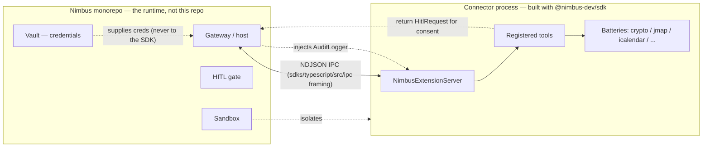
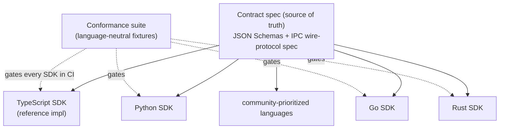

# nimbus-sdk — Architecture

How `@nimbus-dev/sdk` is put together today, and the structural direction the
[roadmap](./ROADMAP.md) is taking it. For the trust / supply-chain model see
[SECURITY.md](./SECURITY.md).

## What this package is

`@nimbus-dev/sdk` is the **authoring contract** for Nimbus MCP connectors and
extensions — the stable, MIT-licensed, **dependency-free** surface that connector
code compiles against. It is types, small pure helpers, and test utilities. It is
**not** the runtime: the gateway, Vault (credentials), HITL (human-in-the-loop)
gate, and the connector sandbox all live in the
[Nimbus](https://github.com/nimbus-agent/Nimbus) monorepo.

Three hard constraints shape every decision here:

- **Dependency-free at runtime.** The published package declares no
  `dependencies`. If a helper is needed, it is inlined. This keeps the
  supply-chain surface equal to this repo's own source.
- **No I/O, no credentials.** The SDK never touches the filesystem, network, or
  environment. Anything that does belongs in the gateway.
- **TypeScript strict, no `any`.** External / cross-boundary data enters as
  `unknown` and is narrowed with a type guard. Biome enforces `noExplicitAny` and
  `noConsole` in `sdks/typescript/src/`.

## The public surface (the `exports` map)

The TypeScript package exposes exactly six entry points. Everything else is internal.
(The Python and Go bindings publish import roots and packages instead; see
[`api-surface-python.md`](./api-surface-python.md) and
[`api-surface-go.md`](./api-surface-go.md).)

| Entry point | Source | Purpose |
|---|---|---|
| `@nimbus-dev/sdk` | `sdks/typescript/src/index.ts` | The main contract: connector/extension types, the Plugin API v1 surface, `NimbusExtensionServer`, and the battery modules. |
| `@nimbus-dev/sdk/testing` | `sdks/typescript/src/testing/index.ts` | `MockGateway` + contract-test / sandbox-probe utilities for connector test suites. |
| `@nimbus-dev/sdk/ipc` | `sdks/typescript/src/ipc/index.ts` | The NDJSON line-reader + IPC framing helpers. |
| `@nimbus-dev/sdk/connector-kit` | `sdks/typescript/src/connector-kit/index.ts` | Dependency-free helpers for hand-rolled MCP connectors: Zod tool registration (`ZodObjectSchema` is a structural type, not a `zod` import), MCP result wrapping, the Bearer-auth REST fetcher, and the search kit (`filterByQuery` / `makeQueryFilter` / `matchesResult` and friends) for in-connector query filtering. The generated TypeScript connector template imports from here. |
| `@nimbus-dev/sdk/diagnostics` | `sdks/typescript/src/diagnostics/index.ts` | The diagnostics / telemetry contract v0: `encodeDiagnostic` / `parseDiagnostic` / `isDiagnosticEvent` / `meetsLevel`, the closed `DiagnosticEvent` envelope, and `createEmitter` for a sink-backed `DiagnosticEmitter`. The redaction-safe replacement for the scoped audit logger's free-form payload. |
| `@nimbus-dev/sdk/signing` | `sdks/typescript/src/signing/index.ts` | Manifest signing under [RFC-0020](./rfcs/0020-manifest-signing.md): canonicalization (`canonicalize` / `canonicalizeManifest`) and the detached JWS envelope (`signManifest` / `verifyManifestSignature` / `generateSigningKey`, base64url, the RFC 7638 thumbprint, the protected header), failing with one `SignatureError`. It replaces the deprecated signing helpers in `crypto/`. |

Changing an exported type is a semver-relevant change — Conventional Commits drive
the release-please bump. The `exports` map, not the file tree, is the API.

## Internal layers

The source is organized into four layers, from most-stable to most-peripheral.

### 1. The contract (the narrow waist)

The shared shapes every author and every product agree on — the *narrow waist* the
whole ecosystem passes through.

- `sdks/typescript/src/types.ts` — `ExtensionManifest`, `NimbusItem`, `ItemType`.
- `sdks/typescript/src/item-types.ts` — the open `KnownItemType` vocabulary + `isKnownItemType`.
- `sdks/typescript/src/agents/` — the agent **briefs** (`brief-types.ts`, `brief-composites.ts`),
  their runtime **guards** (`brief-guards.ts`, `guard-factory.ts`), and the agent
  name registry (`agent-names.ts`).
- `sdks/typescript/src/hitl-request.ts` / `sdks/typescript/src/audit-logger.ts` — the HITL
  request shape and the scoped audit-logger interface the gateway injects.
- `sdks/typescript/src/contract-version.ts`, `sdks/typescript/src/diagnostics/` and
  `sdks/typescript/src/signing/` — contract-version negotiation, the diagnostics envelope
  and manifest signing. Each binds a normative document under [`spec/`](./spec/README.md)
  and runs its conformance corpus, and each is bound in Python and Go too.

Plugin API v1 froze this layer's original core under semver (see
[`../sdks/typescript/CHANGELOG.md`](../sdks/typescript/CHANGELOG.md)). Since
[RFC-0015](./rfcs/0015-tiered-stability.md) every module also declares a stability tier, and
the tiers differ. `types`, `item-types`, `hitl-request` and `contract-version` are `frozen`.
`agents` and `audit-logger` are `stable`. `signing` and the diagnostics emitter are still
`experimental` in TypeScript, while the diagnostics envelope itself is `frozen`.
[`stability-matrix.md`](./stability-matrix.md) gives every capability's tier in every
binding.

### 2. The server scaffolding

- `sdks/typescript/src/server.ts` — `NimbusExtensionServer`, the authoring shape a
  connector's entry module is written against. **Today it is a typed skeleton, not a
  running server:** `registerTool` has an empty body, `start()` validates `manifest.id`
  and returns, and no tool dispatch lives in this package — the MCP loop, the dispatch,
  and the credential handoff all belong to the gateway. Its one working method is
  `handshake()`, a thin delegate to `performHandshake`. The generated connector template
  does not use this class at all; it wires `McpServer` from `@modelcontextprotocol/sdk`
  directly. See [`modules/server.md`](./modules/server.md).

### 3. The batteries (helper modules)

Pure, dep-free helpers connector authors reach for so common work isn't
reinvented. Each is self-contained and independently testable:

- `sdks/typescript/src/connector-kit/` — helpers for hand-rolled MCP connectors: tool
  registration, MCP results, the Bearer-auth REST fetcher behind the `resolveUrlWithBase`
  SSRF chokepoint, and the search kit. Bound in Python and Go too.
- `sdks/typescript/src/crypto/` — JWT signing, Google service-account tokens and App Store
  Connect JWTs, plus the original Ed25519 manifest signing and canonical JSON, which are
  deprecated in favour of `signing/`.
- `sdks/typescript/src/jmap-fastmail/` — JMAP session parsing + email header/preview
  extraction (headers, attachment metadata, and a server-truncated body preview capped
  at 2 KB per email — a hard scope constraint keeps full bodies and attachment bytes out).
- `sdks/typescript/src/icalendar.ts` — iCalendar VEVENT parsing + building.
- `sdks/typescript/src/data-profile/` — column/shape profiling for CSV / JSON / JSONL /
  Parquet (metadata only — never cell values).
- `sdks/typescript/src/flux-cd/`, `sdks/typescript/src/storybook/` — small format helpers.
- `sdks/typescript/src/distribution-channel.ts` — release-channel resolution + upgrade
  hints.

Growth here is deliberately gated by the [inclusion policy](./INCLUSION-POLICY.md)
(dep-free, pure, genuinely reused, contract-shaped) — see also the
[roadmap](./ROADMAP.md#3-batteries-for-connectors--apps).

### 4. Test harness & IPC

- `sdks/typescript/src/contract-tests.ts` — `runContractTests`, which validates a
  connector against the v1 contract (e.g. `assertNoRowDataTools`).
- `sdks/typescript/src/testing/` — `MockGateway` (in-process gateway stub) and the
  sandbox contract / probe utilities.
- `sdks/typescript/src/ipc/` — the NDJSON line-reader that frames messages between a
  connector process and its host.

## Runtime model: how a connector talks to the gateway

A connector is a **separate process** the gateway spawns inside a sandbox. The two
communicate over a stdio stream using **NDJSON line framing** (one JSON value per
line — the `sdks/typescript/src/ipc/` helpers). The SDK builds the *connector* side of
this boundary; the gateway is the host.

```mermaid
flowchart LR
  subgraph nimbus["Nimbus monorepo — the runtime, not this repo"]
    gw["Gateway / host"]
    vault["Vault — credentials"]
    hitl["HITL gate"]
    sbx["Sandbox"]
  end
  subgraph connector["Connector process — built with @nimbus-dev/sdk"]
    srv["NimbusExtensionServer"]
    tools["Registered tools"]
    bat["Batteries: crypto / jmap / icalendar / ..."]
  end
  gw <-- "NDJSON IPC (sdks/typescript/src/ipc framing)" --> srv
  srv --> tools --> bat
  gw -. "injects AuditLogger" .-> srv
  tools -. "return HitlRequest for consent" .-> gw
  sbx -. isolates .-> connector
  vault -. "supplies creds (never to the SDK)" .-> gw
```

Key properties this model gives us:

- **The SDK holds no secrets.** Credentials live in Vault; the gateway supplies
  what a tool needs. The SDK just defines the shapes.
- **Consent is a value, not a side effect.** A tool returns a `HitlRequest`; the
  gateway drives the actual human approval. `isHitlRequest` narrows it.
- **The boundary is a wire protocol.** Because connector ↔ gateway is NDJSON over
  stdio, the connector side is not intrinsically tied to TypeScript — which is the
  hinge the polyglot direction turns on.

## Target architecture: spec-first, one contract, many languages

The lift-out into a **language-neutral spec** is done for Phase 1: the v1 JSON Schemas
for `ExtensionManifest` / `NimbusItem` are published and CI-pinned in
[`spec/`](./spec/README.md), and so are the written IPC wire-protocol spec
([`wire/v1/framing.md`](./spec/wire/v1/framing.md)) and contract-version negotiation
([`negotiation/v1/contract-version.md`](./spec/negotiation/v1/contract-version.md)).
Together they are the single source of truth. TypeScript is the *reference binding*,
not the definition, and every other official SDK is another binding validated
against **one shared conformance suite**. Two such bindings exist today, both official:
Python ([RFC-0008](./rfcs/0008-python-sdk-official.md)) and Go
([RFC-0013](./rfcs/0013-go-sdk-official.md)). Rust has not started.

```mermaid
flowchart TD
  spec["Contract spec (source of truth)\nJSON Schemas + IPC wire-protocol spec"]
  conf["Conformance suite\n(language-neutral fixtures)"]
  ts["TypeScript SDK\n(reference impl)"]
  py["Python SDK"]
  go["Go SDK"]
  rs["Rust SDK"]
  more["community-prioritized languages"]

  spec --> ts
  spec --> py
  spec --> go
  spec --> rs
  spec --> more
  conf -. "gates every SDK in CI" .-> ts
  conf -. gates .-> py
  conf -. gates .-> go
  conf -. gates .-> rs
```

"It compiles" then means "it speaks the real contract," because a binding only
ships once it passes the same suite the reference implementation does. The
conformance suite was seeded from `runContractTests` and the sandbox probe, and has
since grown a corpus for every specified contract and battery;
[`conformance-coverage.md`](./conformance-coverage.md) shows which binding runs which.

See the [roadmap phases](./ROADMAP.md#phases) for the sequence that gets us there —
Phase 1 lifts the contract into the spec; Phase 2 proves the model with Python;
Phase 3 scales to Go, Rust, and beyond.

## Evolving the contract

Because the contract is depended on across products and languages, it changes under
explicit rules rather than ad hoc. The `exports` map is guarded by an API-surface
snapshot test — [`api-surface.md`](./api-surface.md), regenerated with
`bun run build && bun run api:surface` and enforced by
`sdks/typescript/scripts/api-surface.test.ts` — so that an unintended surface change
fails CI. Python and Go have the same kind of gate over
[`api-surface-python.md`](./api-surface-python.md) and
[`api-surface-go.md`](./api-surface-go.md), and the `commit-guard` check compares all three
snapshots against the pull request's declared Conventional Commit type. Deprecations follow the
[deprecation policy](./DEPRECATION-POLICY.md) (mark in a released minor → carried
through a later, separate minor release → removal at a major bump), and a
**contract-version** is negotiated between connector and gateway — specified in
[`negotiation/v1/contract-version.md`](./spec/negotiation/v1/contract-version.md) — so
both know which version they speak. The mechanics live in the
[roadmap](./ROADMAP.md#7-versioning--compatibility) and
[governance](./GOVERNANCE.md#change-classes) docs; the architectural point is that
the contract has *one* place it is defined and *one* process by which it moves.

## Observability & diagnostics

A connector runs out-of-process in a sandbox, so its author cannot just attach a
debugger to the gateway. Two SDK-defined channels carry signal back across the
boundary without leaking data:

- **Audit** — the injected `AuditLogger` (`AuditEmit` sink supplied by the gateway)
  for structured, security-relevant events. Its free-form payload is `@deprecated`
  as of `1.16.0` in favor of the diagnostics envelope below — see
  [DEPRECATION-POLICY.md](./DEPRECATION-POLICY.md) — and may be removed no earlier
  than a `2.0.0` major bump.
- **Diagnostics** — the structured, redaction-safe diagnostic envelope (levels,
  correlation ids, timing) the gateway can surface, under the same data-minimization
  rule as the batteries: no secrets, no row/body data, enforced structurally by a
  closed envelope shape rather than left to author discipline. Published as the
  fifth `exports` entry point, `@nimbus-dev/sdk/diagnostics`, with the Python
  binding at `nimbus_sdk.diagnostics` and the Go binding at `diagnostics`. See
  [roadmap Pillar 8](./ROADMAP.md#8-observability--diagnostics) and the normative
  spec at [`spec/diagnostics/v1/diagnostics.md`](./spec/diagnostics/v1/diagnostics.md).

Both are *contracts the SDK defines*, not I/O the SDK performs — the gateway owns the
sink, the SDK owns the shape.

## Design record

Contract decisions live in the [RFCs](./rfcs/), each with its rejected alternatives. The
decisions below shaped the bindings and the CI gates without changing the contract, so no
RFC carries them. They come from the design specs and implementation plans under
`docs/superpowers/`, which were deleted once their work shipped. The full documents are in
git history: `git log --diff-filter=D -- docs/superpowers/`. Work those designs deferred is
listed under the roadmap's [recorded follow-ups](./ROADMAP.md#recorded-follow-ups).

### The connector kit in Python and Go

- **Python's `Transport` is synchronous only.** A second, async protocol was rejected,
  because it means two surfaces to keep in step and a doubled test matrix. An author with an
  async HTTP client uses the pure pieces directly (`resolve_url_with_base`, `HttpResponse`
  and the `*_if_ok` builders) and loses only `make_rest_tool`.
- **What `Transport.send` raises is part of the protocol.** Anything that is not an HTTP
  response surfaces as `TransportError`, and a timeout as `TransportTimeoutError`, so
  swapping transports does not change a caller's `except` clauses. The name avoids
  `TimeoutError`, which is a Python builtin.
- **The kit ships no validator.** A dependency-free package cannot validate JSON Schema, so
  a tool's `input_schema` / `InputSchema` is sent to the client and never enforced. A
  caller-supplied `validate` reports failure by raising (Python) or returning an error
  (Go). The router turns that failure into an error result, as it does for an unknown tool
  or a handler that fails.
- **Router output uses the MCP wire keys** (`inputSchema`, `isError`), typed as
  `TypedDict`s in Python and structs in Go, so a consumer other than the `mcp` package can
  use it. pydantic appears only in the generated Python template's adapters.
- **Go's `Transport` is the kit's own interface, not a stdlib `Doer`.** Redirect policy lives
  on `http.Client.CheckRedirect`, so only a client the kit builds can enforce
  `url-resolution.md` §8. With a `Doer` seam, a caller passing `http.DefaultClient` would
  lose that protection without any signal. The cost is that a caller who already has a
  configured `*http.Client` writes a one-method adapter.
- **Python and Go export the §8 predicate** (`should_strip_auth` / `ShouldStripAuth`: two
  URLs in, one bool out). §8 binds every transport a binding accepts, and a custom transport
  should not have to write its own origin comparison. A predicate shaped around `net/http`
  types was rejected: it would tie the public surface to `net/http` and break the name match
  with Python. TypeScript has no counterpart because `fetch` already meets §8.

### Go conventions

[RFC-0012](./rfcs/0012-go-sdk-binding.md) records the module layout, the result idiom and the
release model. Four smaller conventions were settled while the packages landed:

- **Names follow Python's, spelled the Go way.** Initialisms are fully capitalised
  (`ResolveURLWithBase`, `JSONResult`, `MCPToolResult`), and `Ok` counts as a word
  (`JSONResultIfOk`). Where Python has no counterpart, the TypeScript name is converted to Go
  convention: `createEmitter` became `NewEmitter`, not `CreateEmitter`.
- **Options are a struct whose zero value is the default**, not functional options, as in
  `ipc.PerformHandshake(os.Stdin, os.Stdout, ipc.HandshakeConfig{})`. Functional options would
  have published a type plus one constructor per field.
- **`contract.SDKVersion()` reads `debug.ReadBuildInfo()`** rather than a constant that
  release-please maintains. A constant would be a second source of truth that could drift
  without failing anything. It lives in `contract`, which a consumer already imports, so it
  needs no new import path, and a separate `version` package would stutter
  (`version.Version()`).
- **The second Go shipment cut a release per part** (handshake, diagnostics, connector kit,
  version accessor) rather than holding one release PR for the whole surface. Extra versions
  cost nothing at the module proxy, while a release PR held open collects unrelated commits
  and arrives as one large, hard-to-review diff.

### The conformance matrix

`docs/conformance-coverage.json`, CI's `conformance` and `conformance-report` jobs, and the
generated `docs/conformance-coverage.md` work together as follows:

- **The declaration lives outside `docs/spec/`.** Which corpora a binding runs is a fact about
  this repository, not a clause of the contract. Keeping it out of `docs/spec/` also keeps it
  out of Go's embedded copy.
- **A case is identified by its `file` entry in the corpus index.** No new identifier was
  added and neither published loader changed. Each binding's test code reads the index itself
  and pairs each entry with the loaded case.
- **A case is recorded only after it passes.** In Go the record is made in a `t.Cleanup` that
  checks `!t.Failed() && !t.Skipped()`. `t.Run`'s return value is not a pass signal: it is
  `true` for a skipped subtest, and immediately `true` for a parallel one.
- **Each language, corpus and producer writes its own report file**, and the reconciler takes
  their union. A second runner for the same corpus, such as `framing` under Bun and again under
  Node, therefore never overwrites the first.
- **The job's matrix axis is language, and it runs on Linux only.** Each language's own job
  already runs its corpora on all three operating systems.

A single harness driving all three bindings through a command-line interface was rejected. It
would have added a fourth test harness and a CLI to three packages designed to be idiomatic
and dependency-free, replacing three index-driven runners that already worked.

### The stability matrix

`sdks/typescript/scripts/stability-matrix.ts` renders `docs/stability-matrix.md` from the three
API-surface goldens and the `<!-- covers: -->` claims in `docs/modules/`:

- **The unit a page claims is the source file that defines an export.** An entry point is too
  coarse: TypeScript's `.` mixes tiers, and Go's `ipc` package and Python's `nimbus_sdk.ipc`
  each span two capabilities. A map of individual exports would need hundreds of entries in
  three spellings. A claim key is the file's path relative to its binding's source root,
  without the extension. The Python and Go goldens record it as `` — from `<key>` `` after the
  tier, matched by a non-capturing group, so the key the commit guard compares on is
  unchanged.
- **The rows are the existing `docs/modules/` pages.** `py:` and `go:` prefixes switch the
  binding a claim belongs to. Only commas separate claims, so a missing comma fails rather than
  being read as two claims.
- **Tiers are read from the goldens on every render and never stored**, so the page cannot
  hold a stale tier.
- **A row whose tiers differ across bindings must say why**, in a `<!-- tier-note: … -->`
  comment on its page, and a row whose tiers agree must not carry one. A `—` (not bound in
  that language) needs no note: gaps are common and would all give the same reason.
- **A capability with no TypeScript module** gets a page that claims zero TypeScript modules.
  `docs-coverage.test.ts` gives this advice when it finds an unclaimed Python or Go file.

Three alternatives were rejected: a curated `stability-matrix.json` (a second list of
capabilities that nothing keeps in step with `docs/modules/`), `@capability` tags in the
source of all three bindings (one cross-cutting idea declared dozens of times), and a
required reason for every gap.
